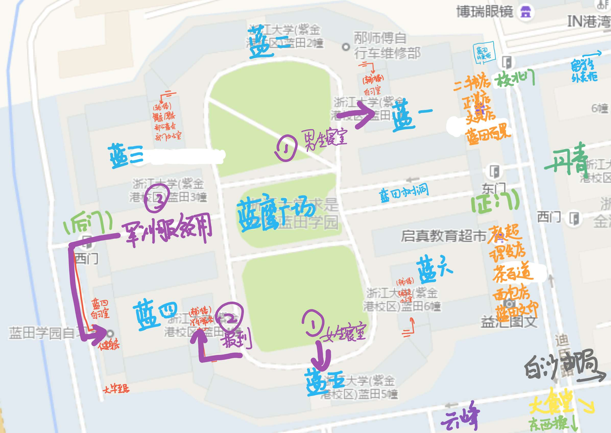
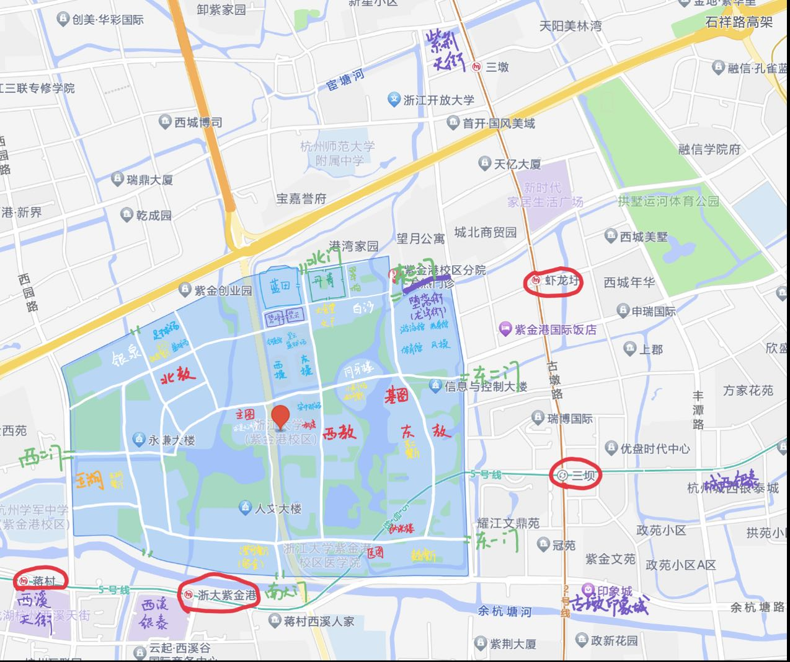
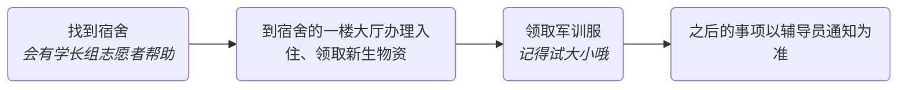

---
author:
    - yy
    - cj
---

# 报到准备

## 重要地点

**图1.** 蓝田周边

**图2.** 浙大周边

## 路线指引

注：本版块以蓝田学园（宿舍区）为目的地。

- 地铁：建议乘2号线到虾龙圩站（5号线浙大紫金港站会远一些，那个是到南大门的）。之后：
    - 打车至浙大紫金港校区北门（北门进来就是蓝田，不到50米，报到期间校内会很堵，建议打车的话就不要入校了）
    - 公交1210M线至浙大校医院站（东三门，距离蓝田大约五百米）
    
- 自驾：新生报到一般可以车辆进校（以实际通知为准），建议从东二门或者西二门进校。东二门→紫云篮球场；西二门→银泉篮球场。报到期间云峰前面应该会禁行，也就是如果停在银泉的话需要走路，大约不到一公里的路程到蓝田。但由于紫云篮球场很靠近三大学园宿舍区，因此会非常堵且找不到位置，银泉相对人少一些，如果不嫌远的话可以停在银泉。

## 物品准备

- 录取通知书

    录取通知书不仅有纪念价值，更是在报到时需要出示的文件！
    > *新版通知书好高级，羡慕qwq*

- 身份证、学籍/团员档案袋等证件材料
- 个人日用品（让你住的舒服的东西！）
- 军训：鞋垫、防晒霜等

## 报到流程

## 宿舍入住

刚到宿舍楼首先要在宿舍大厅填写包括入住表格、身份卡等在内的一系列材料，并领取寝室钥匙（寝室的每个人都有一把，请务必妥善保管）和校园卡[^1]（兼作身份卡、饭卡和水卡）。

办理完成后可以正式开始搬寝室了。如果你是寝室第一个到校的，那么你还需要办理空调租用：寝室空调为预装，遥控器和租用说明默认放在一号床桌上。空调租借费用是全寝 850 元/两学年（请勿多租！两学年后要换寝室）。

> 办理方式：微信公众号 浙江大学公寓管理服务中心 → iHOME → 空调租赁。

以后寝室订水（有饮水机）、设备报修和充值电费等寝室的服务都会在 iHOME 这个平台上进行。

## 新生大礼包和军训服领用

在全都安顿好了之后就可以领用物资啦！根据往年情况军训服领用是在蓝四健身房，新生大礼包领用是在蓝四辅楼学生中心（请以实际通知为准）。

## 银行卡办理

新生会在指定时间办理浙江大学联名的中国银行银行卡，此卡为勤工助学酬金、奖学金发放以及饭卡自动充值等功能默认绑定银行卡。请根据实际通知办理。

## 购买自行车/电瓶车

紫金港校区非常大，寝室和教学楼有一公里以上的距离，因此基本上是人手一辆自行车或电瓶车，新生在军训期间就可以开始挑选心仪的车啦！（军训期间可以临时使用共享单车或者校内共享电瓶车）

另外有组装自行车/修车的需求可以找**蓝田邴师傅**（修车铺，在蓝一和蓝二之间）！他在学生中的评价非常高，是校内修车的不二之选。

[^1]: 校园卡是兼作身份卡、饭卡和水卡的多合一功能卡，**请务必好好保管！**一次性支付金额超过 50 元要求手动输入支付密码，默认密码是本人身份证后六位。如果校园卡丢失请自行到东区大食堂天井的校园卡服务处挂失并补办。