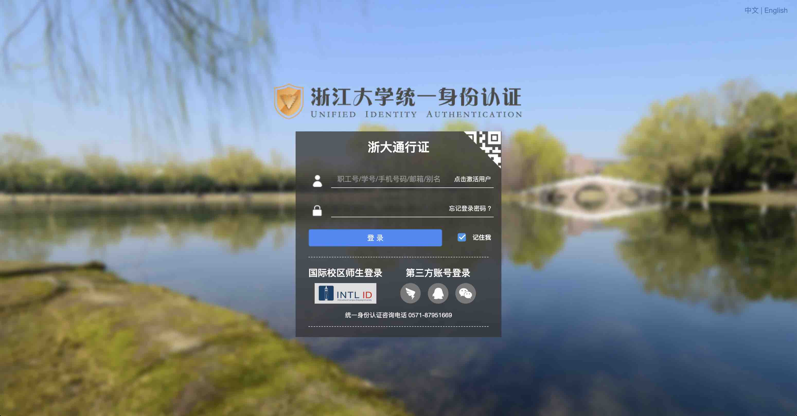

---
author:
    - yy
    - cj
---

# **入学准备**

入学前的准备{++**以录取通知书为准**++}，这里再补充/强调一些事项。

---

## 1. 激活浙大统一身份认证账号

几乎所有的浙大相关资源和服务都需要使用浙大统一身份认证账号登录，请妥善保管好密码。

**图1.** 浙大统一身份认证界面

可以试试第三方账号登录，可以发现是没用的

*不要对浙大的网站抱有太大期望，这是为数不多比较好看且好用的界面了...*

## 2. 新生慕课[^1]

!!! info "关于慕课"
    MOOC (Massive Open Online Course) 是“大规模开放式在线课程”的缩写，“慕课”则是其中文译名。
    
    有兴趣的同学可参阅 :simple-baidu: [百度百科词条](https://baike.baidu.com/item/大型开放式网络课程){target=_blank}
    或 :fontawesome-brands-wikipedia-w: [Wikipedia 词条](https://en.wikipedia.org/wiki/Massive_open_online_course){target=_blank}.

    “**{==学在浙大==}**”和“**{==中国大学 MOOC==}**”是今后学习中最常用到的两个线上平台，详情请移步：[线上学习平台]

在“学在浙大”平台上完成新生慕课，完成并总评达到 90 及以上就可以获得 0.5 [第二课堂] 记点（也就是学分）。
慕课的主要内容是介绍浙大的一些制度、环境、生活等，可以让你们更快地熟悉新的大学生活。

## 3. 新生英语测试

按照《入学须知》的要求在规定时间段内完成新生英语测试，此测试目的是为了区分不同英语水平的同学以预置不同的英语课（大学英语 Ⅲ/大学英语 Ⅳ），测试成绩较高的同学会被预置大英 Ⅳ，相对更难一些。因此……自行思考

!!! note "关于数学和计算机测试"
    这是24级的专属 ~~福利~~，个人猜测是学校的摸底测试，从而调整挂科比例（

    不过不用太过担心！

## 4. 上交学费

在入学前需要自行付清大一学年的学费，包括：基础学费、住宿费、部分学分费、军训服费等。由于特殊原因有困难的同学请联系辅导员。

## 5. 寝室生活习惯问卷

报到前需要填寝室生活习惯问卷（一般是辅导员会统一发送至钉钉群），包括作息习惯（23:30 前/后睡觉）、是否租赁空调[^2]、是否抽烟等等内容，一般会把习惯相近的同学分到一个寝室。

## 6. 学籍/团员档案袋
新生需要请提前去原高中领取学籍档案袋，其中团员还需要领取团员档案袋，请注意检查内容完整性并妥善保管，否则需要补东西很麻烦！报到时请带上，稍后根据通知统一交给班长/团支书。

[^1]: 严格意义上，新生慕课和今后一些课程（如微积分，线性代数等）的慕课其实都是 SPOC (Small Private Online Course)，即只有浙大学生才能参与的小型私有在线课程。但是大家都没管这么多，就叫慕课了。

[^2]: 细心的同学可能会问：为什么要自己租空调？可以参考这个校内论坛（[98](https://www.cc98.org/){title="cc98.org";target=_blank}, 需登录注册 + [校园网]访问）帖子：
 [我们的空调和热水器为什么需要租](https://www.cc98.org/topic/5665713){target=_blank} 
如果有同学有自己购置空调的意愿，可以参考这个帖子： [寝室空调自行购买和安装指南](https://www.cc98.org/topic/5955591){target=_blank}

[第二课堂]: example.com "🚧 施工中..."
[线上学习平台]: example.com "🚧 施工中..."
[校园网]: ../Life/ZJUNet.md