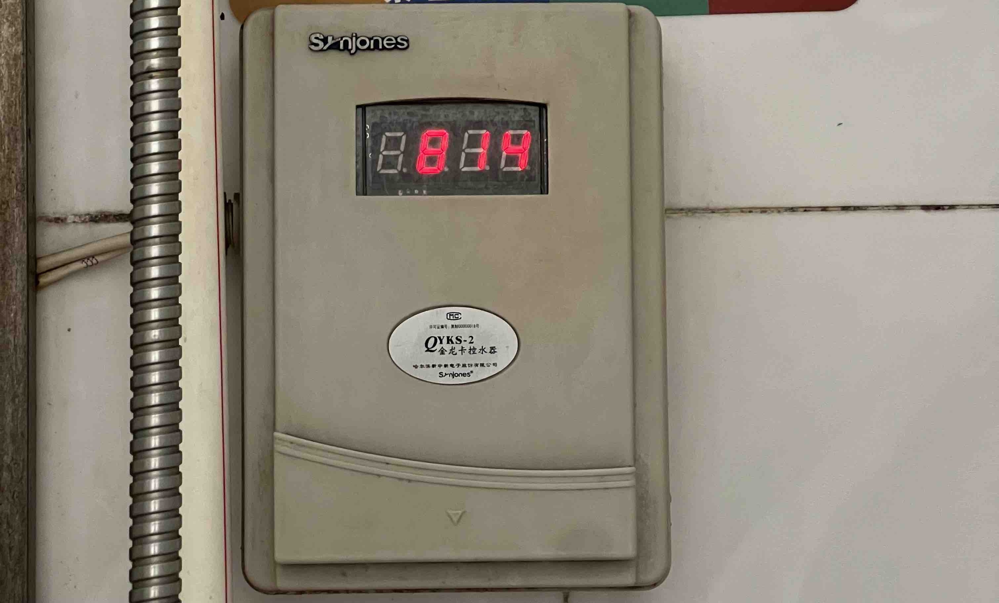

---
author:
    - yy
    - cj
---

# **住宿条件**

## 学园环境

> 注意，是学“园”，不是学“院”哦！

蓝田学园是你们的（~~也是我们的~~）宿舍区，你们要在这里待上两年，两年后要搬到玉泉校区（机械专业除外，一直在紫金港）。蓝田一共六栋宿舍，其中蓝二、蓝五是女舍。六栋宿舍包围着蓝田的中心是蓝鹰广场，许多较大型的学园活动/表演都会在这里举行。蓝鹰广场和蓝田正门之间是蓝田树洞，许多组织的纳新/活动/现宣都会在那里进行。

## 宿舍环境

蓝田的宿舍主要是四人间，有少部分三人间（因为楼道设施占用了一部分空间）。所有寝室都是上床下桌，有阳台，使用公共卫生间。六个寝室为一单元，每一单元配备一个公共卫生间（当然人多的话你也可以使用其他单元的公卫）。公卫由保洁阿姨专门打扫。每个公卫有两个热水洗澡间，其中一个是花洒式，一个是淋浴式；此外还有一个冷水淋浴间（无热水）。其中热水需要插水卡（饭卡）。

!!! tip "关于热水"
    {==第一次使用热水机前，请先用**实体**校园卡消费一次！==}类似于激活操作，楼下的启真教超就可以。注意：用支付二维码是没用的！

    热水机刷一次卡扣费 2.7 元，随后显示屏上会显示（这 2.7 元）的剩余金额。此时可取下卡。可以洗 10 分钟热水澡。

    需要注意的是，**如果洗完澡后 2.7 元没用完，再刷一次卡可退还剩余金额！**

    

    退还时刷卡，显示屏会显示“**Good**”，然后取下卡即可。

    *有的学长学姐还不知道...* 

## 校内生活作息

正常上课期间（包括周末）晚上11：35寝室断电（空调不断电），课程时间请见上课时间表。由于不同同学的课表不同（一般来讲没有两个人的课表是完全一样的，详见[培养方案与选课]），实际作息时间安排请根据自身情况而定。

由于课表不同，上午/午睡起床请不要吵醒正在睡觉的同学哦！另外寝室会根据报道前填写的生活习惯问卷安排，一个寝室的整体作息习惯应该是相近的（应该吧...）。

[培养方案与选课]: ../Study/Concepts.md#_4