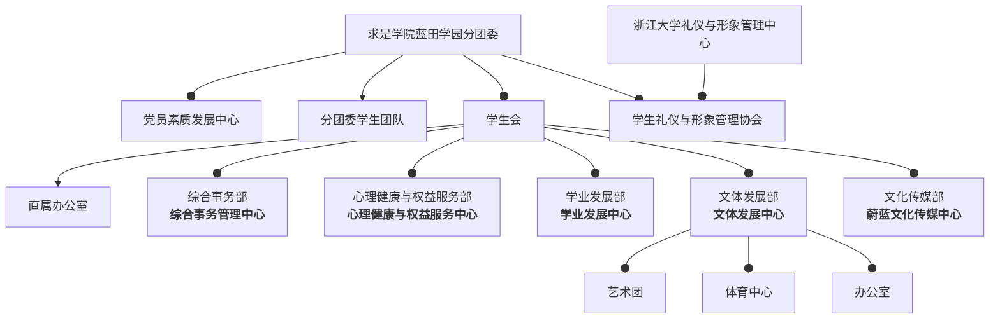

# **学生组织 & 社团**

## 蓝田学生组织架构

下面是对大部分部门的介绍：

- **学生会直属办公室**：作为学生会的核心部门，承担学生会管理、外联、会议等工作，负责学代会等大型活动。温馨的“家”文化，顶尖的内训资源，欢乐的内建活动，助你成长为最优秀的学生骨干。
- **综合事务部**：作为蓝田的“大管家”，负责蓝田学园场地、物资等事务管理，协助开展学园劳动育人、SQTP、NSEP等项目及学生资助工作，是蓝田学园内学生提升综合素质的良好平台。
- **党员素质发展中心**：致力于蓝田学园思想引领、学生党员培训、人党积极分子培养等工作，为广大蓝田青年提供优质的理论学习、红色实践资源，是提升理论水平、政治素养、认知能力的良好平台。
- **分团委学生团队**：负责开展团员青年思想引领、学生素质拓展经历的记录和评价等工作，指导开展包括寒暑期社会实践、志愿服务在内的各类实践活动，促进青年学生全面发展以“做最值得信赖的学生组织”为宗旨，努力营造组织“家”文化。
- **学生礼仪与形象管理协会**：以铺就浙大人内外兼修之路为目标，以礼仪专项能力和形象管理培训为手段，通过丰富的活动形式，将理论与实践结合的专业团队。
- **蔚蓝文化传媒中心**：作为蓝田学园的传媒宣传机构，从平面设计到视频制作，从摄影摄像到推文排版，提供专业、细致的教学，致力于创造出更优秀的宣传品。同时负责管理蓝田学园电子屏，是提升鉴赏能力、设计能力、创新能力的良好平台。
- **文体发展中心**：下设艺术团、体育中心和办公室，以“提升艺术素养发展体育精神、培养组织能力”为宗旨，致力于营造浓厚的艺术体育氛围，培养全面发展的文体精英。
  - **办公室**包含综事部、宣传部两个部门。主要负责文体内部日常工作，大型活动策划以及各种活动的宣传等。
  - **艺术团**包括声乐部、器乐部、合唱团、舞蹈部、语艺部、书画部六个部门。主要工作内容为蓝田学园学生艺术素养提升和校内演出节目的排练。
  - **体育中心**主要负责组织蓝田学园各类体育赛事活动，负责校运会、“三好杯”系列比赛学园代表队报名选拔。
- **学业发展中心**：致力于协助蓝田学园学风建设、学业指导和生涯规划等工作，为广大蓝田学子打造优质的学习平台，提供丰厚的学习资源，营造蓝田学园优良学风。
- **心理健康与权益服务中心**：积极关注同学心理健康，切实维护同学基本权益，搭建沟通同学与学校的桥梁，以友爱包容、务实的理念解决同学在日常生活中遇到的相关问题，呵护心理健康，提升权益意识。