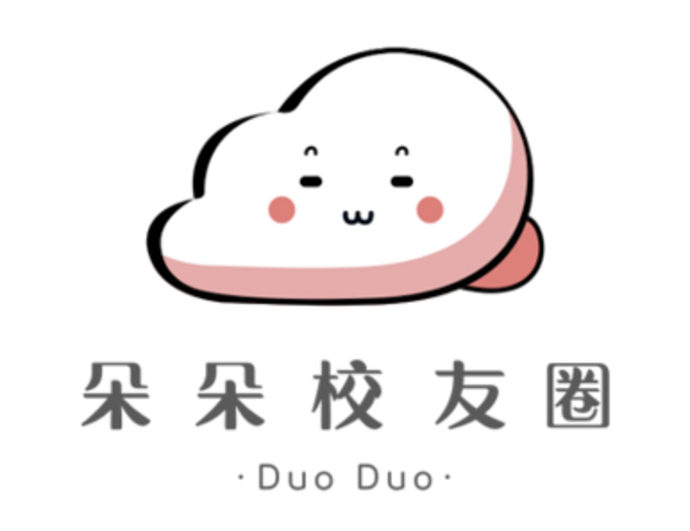

# **线上论坛**

浙大主要有两大线上论坛：CC98 和 朵朵校友圈。

## CC98

> 访问方式：[网页](https://www.cc98.org/){title="cc98.org";target=_blank}/微信小程序，只能通过内网访问

CC98 论坛创建于 2002 年 12 月，前身是计算机学院“王重阳”（98id）老师的答疑版，得名于 98 最初的 IP 地址：`10.71.45.98`，是一个历史悠久的土生土长的校内论坛。

!!! abstract ""
    

    .png)
    

!!! quote "编者个人评价"
    CC98 的用户群体偏高年级学生，发帖的格式可以高度定制化（支持 UBB 代码和 Markdown），且言论管制较为宽松（这意味着极端言论也比公共论坛更多，显得不太友好。实际上大部分人还是很好的哈哈）。

    98 上有很多宝贵的资源，如学习经验、考试资料、就业信息、前辈经验等等。

## 朵朵校友圈

> 访问方式：微信小程序

!!! failure ""
    

    
    

!!! quote "编者个人评价"
    界面更加精美的论坛，帖子长度整体来说比 98 短一些，格式比较单一，表情也只有朵朵自带的表情包。但是论坛氛围更加友好，用户群体更加年轻。

    但严格意义上说，朵朵校友圈并不是一个校内论坛。很多高校都有自己的朵朵校友圈，也提供会员服务，是一个商业化的平台。

!!! warning "注意"
    （浙大的）朵朵校友圈也有部分不是浙大学生的用户，注意网络信息安全。
    
    98 也可能会有一些非浙大学生的用户，但是相对较少（账号违规外借）。