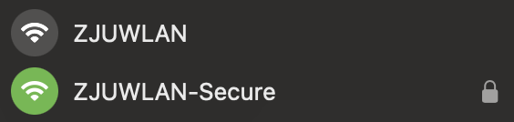
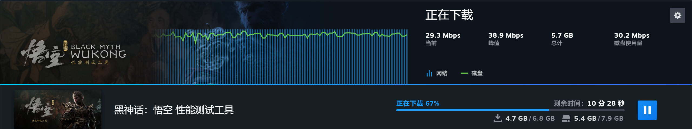
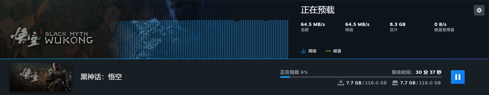

---
author:
    - cj
    - yy
---

# **校园网**

校园网指浙江大学的内部局域网。平时上网除了用手机流量外就是用校园网了。

## 开通校园网

**校园网是必须开通的，很多校内学习/办公网站和服务只能通过内网访问！**

校园网络服务是收费的。共有三个套餐选择：10元/月、30元/月、50元/月，区别就是访问校外资源的网速上限不同。

经实际测试[^1]，大致的限速为

| 套餐费用 | 并发数	| 网络限速 |
| :---: | :---: | :---: |
| 10元/月 | 4 | 30Mbps |
| 30元/月 | 5 | 50Mbps |
| 50元/月 | 6 | 80Mbps |

第一个月免费试用，之后在[浙大信息技术中心 (myvpn.zju.edu.cn) ](http://myvpn.zju.edu.cn){target=_blank}缴费。

第一次进入这个网站请点击登录按钮下方的激活账号，这样也会同时完成邮箱的激活。

不过一般来讲 10r/月的套餐能满足大部分需求。

## 无线网

校园网有两个无线网名称（不含海宁校区）：`ZJUWLAN`和`ZJUWLAN-Secure`。前者连接后会跳出统一身份认证界面；后者连接后会要求输入用户名和密码。详见[信息技术中心的帮助文档](https://itc.zju.edu.cn/2021/0128/c12077a2248578/page.htm){target=_blank}。

## 有线网

蓝田宿舍每个桌子下面都有网口，网线可以在营业厅免费领取。
插上网线后，打开[网络认证界面](https://net.zju.edu.cn)，登录后即可使用。

有线网相较无线网更稳定，适合对网络要求比较高的同学。

!!! info "关于 IPV6"
    `ZJUWLAN-Secure` 和有线网支持 IPV6。

    IPV6 的好处是：

    1. 个别网站仅支持 IPV6 访问，比如北邮人 PT 站。
    2. **速度快。**蓝田的网口是千兆网。

    下面是 Steam 下载的个人实测结果：

    
    
**图1.** 10元套餐限速

    通过 IPV4 下载时，可见下载速度卡死在了 30 Mbps。

    
    
**图2.** 有线网连接 + IPV6重定向工具

    让 Steam 通过 IPV6 下载，速度达到了 500 Mbps 以上。

    想进一步了解 IPV6 的同学可以参考 :simple-baidu: [百度百科词条](https://baike.baidu.com/item/IPv6){target=_blank}。

## 校外连接[^2]

有的时候我们身处校外，但又需要校园网环境来访问院网、CC98等内网环境。校外连接校园网的方式大致有3种方式：

#### WebVPN

WebVPN 是浙大提供的一种访问校内资源的服务。只需要用打开 [WebVPN](https://webvpn.zju.edu.cn/){target=_blank} 网页，输入账号密码即可访问校内资源，无需下载任何软件。然而，WebVPN 有以下几个缺点：

- 未使用 HTTPS，安全性缺乏保证
- 访问一些网站需要多次输入网址
- 无法代理 ssh、ftp 等协议，资源访问受限

#### RVPN

RVPN 是浙大提供的另一种 VPN 服务，可以让我们在校外连接到校内的网络。然而，**极其不推荐**在电脑上通过学校提供的 RVPN 客户端（也就是深信服的 EasyConnect 软件）进行连接，因为：

> - L3 全局代理，路由规则配置不当，减慢网络速度，劣化 NAT 类型 (比如想要 SSH 连接学校服务器的同时访问 Google 搜索资料，代理也会经过 VPN，速度可能大幅下降甚至不可用)
> - 与其他代理软件产生冲突，与其他软件(如游戏反作弊)容易产生冲突
> - 安装驱动 & 后台常驻，占用资源，安装该公司自行签发的 CA，劫持系统 DLL，降低系统安全性
> - 软件设计对系统侵入性强，卸载后仍有残留，容易造成未知的问题

引自  [https://www.cc98.org/topic/5521873](https://www.cc98.org/topic/5521873){target=_blank}。其中安装根证书的行为从根本上破坏了 HTTPS 的安全性，这意味着其可能可以窃取你的网络数据。

所以，我们**强烈推荐**动手能力强的同学使用另一种方式连接 RVPN。CC98的 [MythLi](https://www.cc98.org/user/id/619826){target=_blank} 开发了 [ZJU Connect 多合一客户端](https://www.cc98.org/topic/5704061){target=_blank}，完美替代了深信服的 EasyConnect 软件。同学们可以自行查看链接里的使用说明。

需要注意的是，无论使用何种客户端，RVPN 对内网的连接都是受限的，不能也不允许用于 BT 分享，出于安全考虑 SSH 的 22 端口也被封禁。

[^1]: 数据来源：[浙江大学本科新生指引](https://zjuers.com/welcome/life/network/#_5){target=_blank}
[^2]: **该节内容全部来自**[浙江大学本科新生指引](https://zjuers.com/welcome/life/network/#_11){target=_blank}