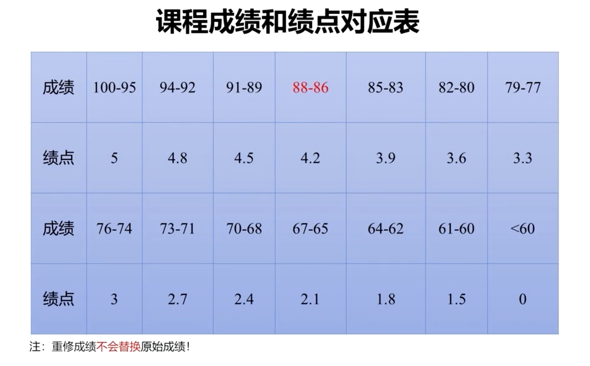

---
author:
    - yy
    - cj
---

# **学业基本制度**

!!! quote "竺老两问"
    **诸位在校，有两个问题应该自己问问，第一，到浙大来做什么？第二，将来毕业后要做什么样的人？**

这两个问题你一定在录取通知书上看到过。这个问题要用几年甚至一生去回答，每个人的答卷也一定不同。但是，毕业应当是第一个问题的最低要求。接下来会介绍一些学业方面的基本制度。

## 学期

浙大的一学年分为**秋冬学期**、**春夏学期**和暑学期（俗称**短学期**）。秋冬学期分为秋学期（八周）、冬学期（八周）和期末考试周（两周）；春夏学期同理。暑学期课程请查询培养方案，持续时长由对应课程而定。期中考试安排在秋（春）八周和冬（夏）一周周末，期末考试安排在期末考试周。只有部分课程需要期中考。

此外部分课程仅持续半个长学期（八周），秋（春）学期对应课程期末考安排在期中考试时间，冬（夏）学期对应课程期末考安排在期末考试周。

## 学分和绩点

> **简单来说，学分是“量”，绩点是“质”**

大学的学习生活中每一门课程都有对应的学分，学分的多少和该课程的每周学时有关。比如：
> 微积分（甲）Ⅰ：5学分 | 5（+1）周学时
> 
> Python程序设计：3学分 | 4周学时。

每一门课程根据你的上课表现、作业情况和考试情况会给定一个总体评价分数（总评），根据总评会获得一个对应的绩点。最常用的绩点制是**五分制**，其与百分制成绩对应关系如下：

**图1.** 课程成绩和绩点对应表

**均绩**（GPA, Grade Point Average）是所有课程绩点的加权平均，是对学生学业成绩的综合评价（但不是全部！）。其计算方法是：

$$\text{均绩} = \sum \frac{\text{课程学分}\times\text{课程绩点}}{\text{总学分}}$$

*（公式加载不出来刷新网页即可）*

每一个长学期和学年都会计算一次学期/学年平均绩点。学年均绩和该学年的个人荣誉（学习类）申请、奖学金申请以及保研申请有关。

## 培养方案

在大学，每一个人的课表都是独一无二的。同一个大类内的同学，由于专业不同，培养方案不同，修读的课程也就不同；哪怕是同一个专业的同学，虽然培养方案一样，但是由于有不同的授课教师以及不同的授课时间，因此课表也会完全不一样；此外还有个性选修的通识选修课程，也会影响课表的布局。

由于选课依据的是培养方案，因此首先要学会看培养方案，随后按照培养方案进行选课。

培养方案查询的**唯一官方网站**是[教务网](http://zdbk.zju.edu.cn){target=_blank}。

## 一二三四课堂

第一课堂指传统意义上的校内课程学习，此外浙江大学还有第二课堂、第三课堂和第四课堂，也有学分要求。

> 关于二三四课堂的规范性文件，请参阅[浙江大学本科生第二、三、四课堂学分管理办法（最新为 2024-01-15 版）](http://10.203.3.207:8080/xwfw/gfxwj/tpl/template-1/info.html?id=3237&list=gfxwj&context=&style=){target=_blank}

- 第二课堂是指学生**在校内参加的各类实践项目**，包括参与理想信念教育、文化艺术活动、学科竞赛、创新创业和科研实践训练、科学研究、学术报告、学生工作等；
- 第三课堂是指学生**在校外、境内参加的各类社会实践、就业创业实践实训等项目**，以及校内外**志愿服务**活动；
- 第四课堂是指学生参加国（境）外高校等开展的各类**国际化学习交流活动**。

!!! info "注"
    有关第二三四课堂的表述中，“记点”等同于“学分”。

### 第二课堂

> 学分要求: 4分（其中美育二课分至少1分）

主要来源：

- 参加（有二课认定的）各类文体活动（比赛类根据名次给分、表演类出演0.5分/次）
- 观看文艺演出（0.15分/次）
- SQTP 项目（根据收验成绩给分）等。

其中需要至少1分的美育二课分，主要来源是**参加美育类演出/讲座**（作为出演人员 0.5 分/次、作为观众 0.15 分/次）

尤其需要注意美育二课，{==美育满 1 分是硬性要求==}，大部分同学美育二课的主要来源是观看文艺演出，因此需要 7 次有效观看（指完成报名、签到和签退）才可以达标，所以需要尽早开始积累。当然也可以参演文艺类表演，有文艺类特长的同学可以选择加入一些艺术团，就不需要担心美育二课的问题了。

### 第三课堂

> 学分要求: 2分

主要来源是：

- 社会实践
- 参加志愿者活动

其中社会实践{==需要至少一次==}（通过考核 1 分/次，校级优秀 1.5 分/次）（注意一个长假期只能认定一次）。

志愿者根据小时数评定星级，依据志愿者星级给 1.5 - 3.5 的三课分。

| 志愿者星级 | 一星级 | 二星级 | 三星级	| 四星级 | 五星级 |
| --- | --- | --- | --- | --- | --- |
| 所需小时数 | 40h | 70h | 150h | 200h | 250h |
| 对应三课记点 | 1.5 | 2.0 | 2.5 | 3.0 | 3.5 |

### 第四课堂

国际交流学分2分，注意这个和**国际化课程学分**是不同的！

所有获得四课分的方式如下：（摘自官方文件）

1. 赴国（境）外高校等参加并完成与我校共建的 2+2、3+X等联合培养项目；
2. 赴国（境）外高校等参加交流项目并获得有效课程学分；
3. 赴国（境）外高校等参加 4 周及以上的各类交流项目并提供修读证明等相关材料；
4. 赴国（境）外高校等参加少于 4 周的交流项目且没有获得有效课程学分的，需再修读 1 门经学校认定的国际化课程且考核通过；
5. 参加线上境外交流项目并达到《浙江大学本科生线上境外交流与合作项目管理办法（试行）》（浙大本发〔2022〕4 号）中关于“国际化模块”的要求；
6. 参加线上境外交流项目，但未达到《浙江大学本科生线上境外交流与合作项目管理办法（试行）》（浙大本发〔2022〕4 号）中关于“国际化模块”要求的，需再修读 1 门经学校认定的国际化课程且考核通过；
7. 已获得第三课堂 2 学分并认定等级者，使用其多余记点中的 2 记点替换“第四课堂”学分的，需再修读 1 门经学校认定的国际化课程且考核通过。

其中特别需要注意四课认定的第 7 条，即所谓“三转四”，也就是如果可以获得 4 分的三课分，可以选择把多余的 2 分转为四课分，再修读一门校内认定的“国际化课程”即可完成四课要求，就不需要再进行国际交流。