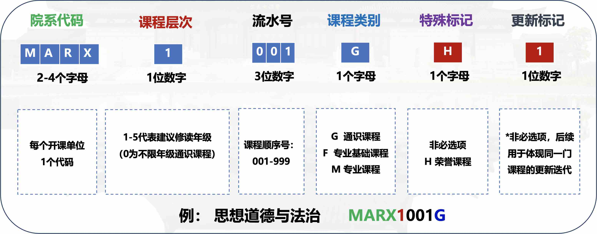

# **选课**

> 98 选课答疑楼置顶 
>
>  [【学习天地】【版面活动】2024级本科新生选课答疑楼](https://www.cc98.org/topic/5962162){target=_blank}

!!! tip "2024级培养方案新变动"
    1. 个性修读课程的学分增加到了 15 学分。详见[个性修读课程]。
    2. 认定型课程新增心理健康类课程要求。详见[其他必修环节]。
    3. 课程编码规则有所变动，如下图所示。
        

## Q & A 精选

> 来自 [2024级本科新生选课答疑楼](https://www.cc98.org/topic/5962162/1#2){target=_blank}，感谢 [@靜水深流](https://www.cc98.org/user/id/733214){target=_blank} 的整理和贡献提问和解答的同学们。

### 选课系统

???+ question "关于选课志愿排序，是一志愿选上了二三就自动放弃了还是都能选上？"
    点击选课界面右边长条，可以看到已选课程界面，里面可以调整志愿排序。只要选上前一个志愿，系统就自动让你放弃其后的志愿；系统不会让你选上同一个课程编号的两个平行教学班，也不会同时选上两门体育课。

???+ question "教室编号旁边的“录播”是什么意思？"
    教室编号旁边的“录播”，意思是这个教室有进行录像的器材，[智云课堂](https://classroom.zju.edu.cn/)上有课程回放。如果这门课是线上上课的话，教务网会另外注明。如果没有特别注明，就默认线下上课。

???+ question "想退预置的基础课程，有什么要注意？"
    确定不希望上预置课的话，就退掉预置，自己再选要修的课程，但是新选的教学班一定要尽可能填满志愿，而且冷热门结合，把至少一两个志愿填到不热门的老师那里，以确保选上。第一轮选课后要是发现没选上，到第二轮选课就一定要保险，尽可能抽个奖。过了第二轮还没有的话就得补选了。

???+ question "选课系统里“跨类”分页的主修和辅修是什么意思，是否影响选课？"
    选课系统里的主修和辅修，只是标记哪些课程主要面向主修和辅修的同学，其实不用理会，可以用搜索功能直接搜课程编号，然后选对目标专业培养方案要求的那门课就可以了。一般来说，只要课程编号对上了就没有问题，不过特殊培养项目和国际化学分则另作别论。

    大一还没有确定辅修，不用选专门面向辅修的教学班。

### 课程种类

???+ question "创新创业类课程是什么，大一是否要选？"
    是一类课程，包含职业规划、创业启程、创业基础等课，四年内必须修读其中一门，不需要知识储备基础，大一可以选，不过不一定选上。

???+ question "通识核心课程大一能选吗？一定要选吗？"
    通识课一般都是科普、介绍性质的，除非特别说明，否则面向全体同学，不会需要专业知识储备，因此不用担心因为知识量问题而跟不上进度。通识核心课程与其他通识课的区别，在于工作量较大，有更多小组展示等各种形式的任务要求。

    所有学期都可以选通核课，不限制年级，只要本科期间修完一门就可以了。通核课很多时候是分组的，组内很多时候都有高年级和低年级同学混合，大家互补不足。课上通常大一到大四的同学都有。

    至于是否推荐在大一选通识核心课程，版友们有不同的意见，建议新生朋友结合自己对学习和成绩的期望，斟酌参考。

???+ question "课程覆盖是怎么一回事？我选了数学分析 I 课程，还需要选微积分吗？"
    浙大规定了“课程层次”，微积分这种数理基础课之间的层次高低之分，高层次课程的学分可以覆盖低层次对应课程。如果你决心选高层次课程，也有信心及格，那就不用再选对应的低层次课程了。
    
    说具体一点，如果你意向专业的培养方案写着必修课程A，而对应这门课有较高层次的课程B，你只选了B而且取得及格，那么自然满足了课程A的修读要求，不需要再修课程A。

    **要注意的是：**
    
    1. 如果计划转专业，要注意意向专业规定必修哪个层次的课，对修过较高层次课程的转专业申请人会否优先考虑
    2. 较高层次课程的难度可能较高，要注意是否能负担。

???+ question "如果自己不属于某门课程的面向对象，能否选课？"
    绝大部分课程的面向对象是不严格的，哪怕写了面向竺院或者某某专业，也欢迎不属于这些学院的学生去选课。小部分课程则不太方便，可能会私下联系同学退掉。不确定的话可以问问开课的老师。

### 课表安排

???+ question "有预修要求是什么意思？"
    对于一些“硬核”的课程，为了确保学生能跟上进度，老师强烈建议学生先学过预修要求课程里面的前置知识，才去上这门课。（比方说没学过基本微积分知识的话，很可能难以学明白进阶的数学课）
    
    预修要求通常不是强制性的，老师不会看你不满足要求就强制退课。不过这样可能自己学着难受，跟不上进度，建议斟酌一下课程难度是否能掌握。

    P.S. 有的课程预修要求会有不准确的情况...

???+ question "现在的课表看不出自己专业特色，正常吗？"
    大一上以通识教育或者基础课为主，通常没有专业课，是正常现象，而且是学校专门这样设计的。

???+ question "第一轮要选通识课吗？"
    **建议选。**大一上学期时间算是比较多，又是好奇心和精力比较旺盛的时候，正好多修通识课。很多通识课不好选上，如果想选，有必要第一轮就选，来增加选上课的概率。

???+ question "假设我选了A老师的课，然后想去听B老师的课，可以吗？性价比高吗？有实现空间吗？"
    你选上的教学班有机会安排点名和小测，人不在教室的话可能失去平时分。

    “性价比”见仁见智。有一种观点是：没有必要过分执着于上某位老师的课，虽然有些老师是名气特别大，但是很多其他老师的教学水平其实也很不错，或许你也会喜欢，或许比名气大的老师更适合你，都是要尝试了才知道。当然如果你选上的教学班实在讲得不适合你，让你学不明白，那这时候去寻求其他老师的教学，也是有需要的，因此可以先上几节课再考虑。

???+ question "选了大英三，在大一可以考四级吗？"
    大学生都可以考四级，与有没有修读过外语课程没有关系，系统不会因此不让报考。

### 专业选择

???+ question "有转专业意愿，这次选课应该怎么选？"
    假设你想从A专业转到B专业。数理基础课可以选A和B培养方案中更高层次的那一个（例如：数学分析I>微积分甲>微积分乙>高等数学），这样不管最后到了A还是B专业，都能满足必修要求（高层次课程一定能替换低层次课程，反之不一定可以）。
    某些专业如果需要转入，可能会强制要求修过某些课程。因此，强烈建议参考[各专业接收学生转专业修读课程及学业基本要求](https://bksy.zju.edu.cn/2024/0821/c28340a2954069/page.htm){target=_blank}当中，B专业有没有要求修完什么课才可以申请转入。可以问问学长学姐，了解B专业对申请人的什么能力更看重，从而选对应的课。
    
    可以看看B专业培养方案有没有建议大一秋冬学期修读的课程，在能负担课程压力的前提下选一两门。哪怕最后转专业不幸失败，没转进去，这些课的学分可以用作个性学分，成绩会算进总绩点而不算进主修绩点。建议具体问题具体分析，充分了解A和B专业的相关政策再决定。（所以如果提问转专业问题，建议说明你的A和B专业具体是哪一个，以便版友给出针对性的意见）

???+ question "转专业难不难？"
    不能一概而论——因为热门程度不同，各专业的转入难度可谓天差地别。因此，强烈建议明确你的提问。

???+ question "我很纠结要不要选某某某专业，学长学姐有什么参考意见？"
    论坛上已有很多关于不同专业学习情况的前人分享，建议善用论坛的搜索功能，就能找到前辈的心得体验和已有讨论了。除了搜专业全名，可能也需要尝试搜索专业和院系名称的缩写等其他关键词，因为搜索功能目前还在完善当中，不能检索同义词。
    
    此外，可以试试看找学习天地版面的精华帖子列表，看看有没有专业选择相关的有价值信息。不同人对于选专业的着眼点和意见都不一样，众说纷纭，建议自己斟酌参考。

???+ question "对其他专业有一点兴趣，但不是很确定要不要转，怎么办？这时候选课要注意什么？"
    如果对某一个专业有一点兴趣，又不知道自己是否真正喜欢，且目前学有余力，我个人认为可以**选一下该专业最入门的专业基础课**，来感受是否适合该专业的学习。此外，如果自信可以应付，或许**修较高层次的数学基础课**会给到更大的选择权。这样万一你到时候确实要转专业，就能给到一个优势。本科生院最新文件，明文规定了转专业申请人学业条件要求。如果你想转的专业有硬性条件，就要多注意，选好需要的课程。该专业比较热门的话就要努力提升绩点。

    如果不确定是否喜欢，建议多咨询该专业的老师和学长学姐，因为转专业成功一次就不能再转了。

### 其他

???+ question "可以旁听没有选上的课程吗？"
    **大部分课程都欢迎旁听**，尤其是人多的大课和理论课、基础课。小部分课程可能不太方便，例如：实践课（不能随便让一个不认识的学生碰实验仪器），人少的专业课（冷门专业通常会很照顾同学们的体验，一个陌生人太明显了，而且老师不一定有此准备），一些艺术课和外语课（对每个学生需要个别投入耗材和时间，没有准备给旁听生）。比较稳妥的做法可能是先跟老师打个招呼，比如课前在钉钉问一下能不能旁听等。也可以用智云课堂来旁听网课。

???+ question "辅修是怎么一个操作？什么时候需要去了解？"
    大一春学期才会有辅修等项目，到时候本科生院网站会有通知。大一秋冬可以先适应大学学习的节奏，看看自己是不是学有余力，对什么专业有兴趣，然后再做决定。

[个性修读课程]: ../Study/Concepts.md#4
[其他必修环节]: ../Study/Concepts.md#5